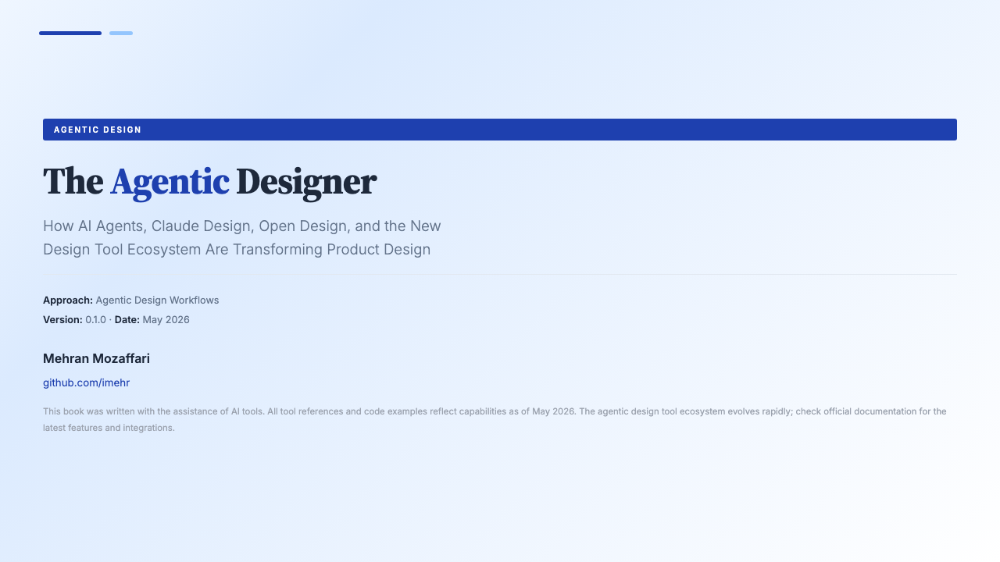

# The Agentic Designer

> A comprehensive guide to designing with AI agents — from first principles to production systems.

**Author:** [Mehan Mozaffari](https://github.com/imehr)
**Version:** 1.0.0
**Date:** May 2026
**Pages:** 251
**Words:** ~47,000

## About

This book covers the emerging field of agentic design — how designers and developers use AI coding agents (Claude Code, Codex, OpenCode, Gemini) to produce professional visual output. From understanding what agents are, through teaching them design systems, to orchestrating multi-agent design teams for production UI.

---

## Front Cover

---

## Table of Contents

- **Chapter 1:** The Agentic Design Paradigm
- **Chapter 2:** Your Agent Toolkit
- **Chapter 3:** Teaching Agents to Design
- **Chapter 4:** Design-as-Code
- **Chapter 5:** Paper and Pencil
- **Chapter 6:** Open Design and OpenPencil
- **Chapter 7:** Huashu Design
- **Chapter 8:** Design Systems and Tokens
- **Chapter 9:** Motion and Video
- **Chapter 10:** MCP Integrations
- **Chapter 11:** Multi-Agent Design Teams
- **Chapter 12:** Production UI from Design
- **Chapter 13:** Real-World Case Studies
- **Chapter 14:** The Future of Agentic Design
- **Appendix A:** Quick Reference
- **Appendix B:** Prompt Library
- **Appendix C:** Glossary

---

## Downloads

| Format | File | Size |
|--------|------|------|
| PDF | [book.pdf](book.pdf) | 2.0 MB |
| ePub | [book.epub](book.epub) | 170 KB |
| HTML | [Web Version](web/) | — |

---

## Changelog

### v1.0.0 — May 2026

- Initial release
- 14 chapters + 3 appendices
- 251 pages, ~47,000 words
- 80+ annotated screenshots
- Islamic geometric cover art

---

*Generated by [Agentic Book Writer](https://github.com/imehr/agentic-book-writer)*
*© Mehran Mozaffari*
