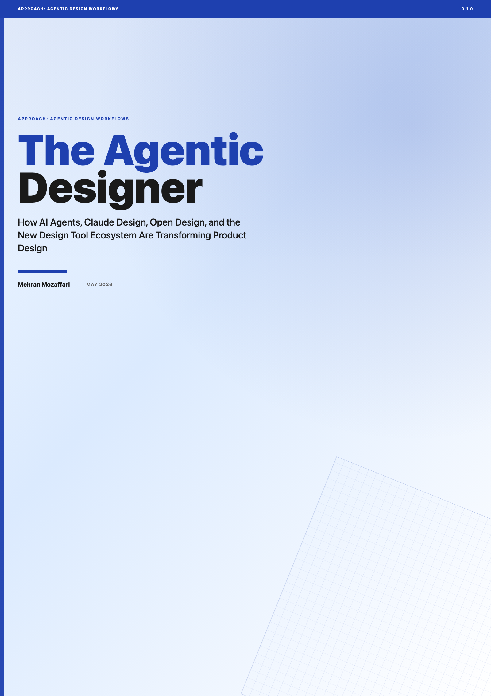

# The Agentic Designer

> How AI Agents, Claude Design, Open Design, and the New Design Tool Ecosystem Are Transforming Product Design · by Mehran Mozaffari

Full breadth: the agentic design paradigm, agent platforms (Claude Code, Codex CLI, OpenCode, Gemini CLI), design-for-agents harnesses (CLAUDE.md, AGENTS.md, skill files), design tool ecosystem (Claude Design, Open Design, OpenPencil, Huashu Design), design-as-code workflows, motion and video design (Remotion, Hyperframes), MCP integrations (Figma, Miro, MagicPattern), multi-agent design teams, real-world case studies, and the future of autonomous design systems

## Download

| Format | File |
|--------|------|
| HTML | [01.html](01.html) |
| HTML | [02.html](02.html) |
| HTML | [03.html](03.html) |
| HTML | [04.html](04.html) |
| HTML | [05.html](05.html) |
| HTML | [06.html](06.html) |
| HTML | [07.html](07.html) |
| HTML | [08.html](08.html) |
| HTML | [09.html](09.html) |
| HTML | [10.html](10.html) |
| HTML | [11.html](11.html) |
| HTML | [12.html](12.html) |
| HTML | [13.html](13.html) |
| HTML | [14.html](14.html) |
| HTML | [A.html](A.html) |
| HTML | [B.html](B.html) |
| HTML | [C.html](C.html) |
| HTML | [front-matter.html](front-matter.html) |
| Paged HTML Preview | [the-agentic-designer-paged.html](the-agentic-designer-paged.html) |
| ePub | [the-agentic-designer.epub](the-agentic-designer.epub) |
| HTML | [the-agentic-designer.html](the-agentic-designer.html) |
| PDF | [the-agentic-designer.pdf](the-agentic-designer.pdf) |

## What This Book Covers

Full breadth: the agentic design paradigm, agent platforms (Claude Code, Codex CLI, OpenCode, Gemini CLI), design-for-agents harnesses (CLAUDE.md, AGENTS.md, skill files), design tool ecosystem (Claude Design, Open Design, OpenPencil, Huashu Design), design-as-code workflows, motion and video design (Remotion, Hyperframes), MCP integrations (Figma, Miro, MagicPattern), multi-agent design teams, real-world case studies, and the future of autonomous design systems

18 chapters are included in this release.

## Who Is This For

product designers, design engineers, and creative technologists who want to build autonomous design workflows using AI coding agents and specialized design tools

## Repository Contents

| Path | Purpose |
|------|---------|
| `README.md` | Public landing page for the book repository |
| `CHANGELOG.md` | Version-by-version release notes |
| `LICENSE.md` | Book license |
| `cover.png` / `banner.png` | Public book artwork when available |
| `assets/` | Public supporting assets |
| `screenshots/` | Public screenshots used by the book |
| `*.pdf` / `*.epub` / `*.html` | Published book artifacts |

## About the Author

Mehran Mozaffari

## Credits

| Role | Credit |
|------|--------|
| Author | Mehran Mozaffari |
| Editorial review | Multi-model AI review pipeline |
| Technical reviewers | Claude Opus 4.6, Gemini 3.1 Pro |
| Design and production | Agentic publishing pipeline (OpenCode) |

## Contact the Author

- Blog: [https://piazr.github.io/applied-ai/](https://piazr.github.io/applied-ai/)
- GitHub: [https://github.com/imehr](https://github.com/imehr)

For corrections, errata, or licensing inquiries, please open an issue on this repository or contact the author through the channels above.

## Version

- **v0.1.0** — May 2026
- AI tools evolve rapidly; check the official project documentation for current product behavior.

## License

[CC BY-NC-SA 4.0](https://creativecommons.org/licenses/by-nc-sa/4.0/) — free to share and adapt with attribution, non-commercial use only, under the same license.
